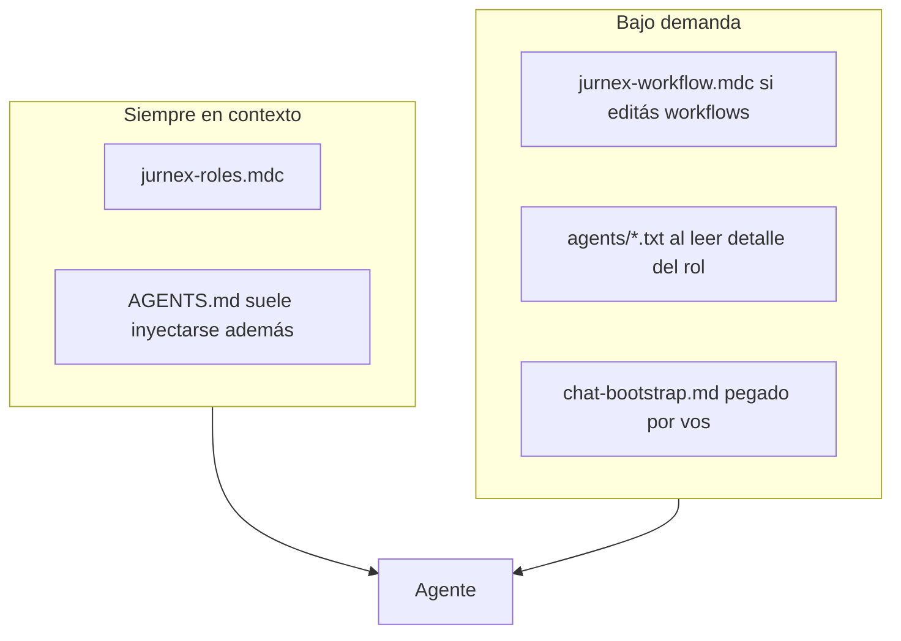
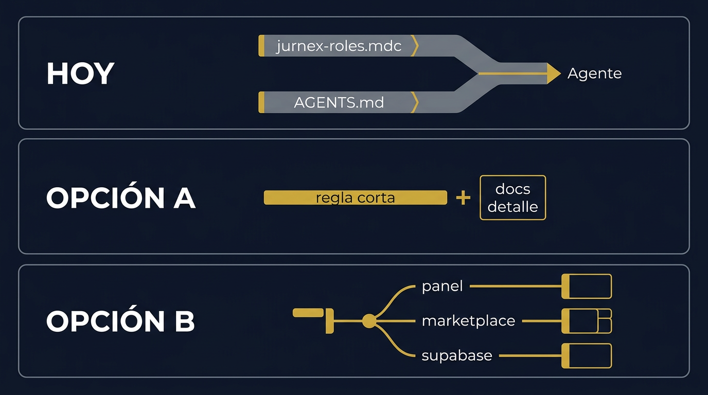

# Propuesta — Marco de roles Jurnex y “carga” en Cursor

**Alcance:** cómo está armado hoy el marco de expertos (PM, UX, Tech Lead, Dev, QA, Data, Growth) en el repo y en el IDE, por qué se siente **pesado**, y **tres direcciones** para aligerarlo.  
**Importante:** esto es **solo propuesta**; no implica cambios en `.cursor/rules`, `AGENTS.md` ni `agents/*.txt` hasta que validés una opción.

---

## 1. Qué es hoy la “página” (contexto que siempre carga)

No hay una URL web única: la “carga” es el **paquete de instrucciones** que el agente recibe al trabajar en el repo.

| Capa | Archivo / mecanismo | Rol |
|------|----------------------|-----|
| Regla siempre activa | `.cursor/rules/jurnex-roles.mdc` (`alwaysApply: true`) | Lista de 7 roles, reglas duras, stack, estructura, convenciones, sprint Q2 |
| Bootstrap repo | `AGENTS.md` | Misma idea en otro formato: producto, 7 roles, reglas, stack, árbol, Linear |
| Reglas por glob | `.cursor/rules/jurnex-workflow.mdc` (solo `workflows/**`) | Patrón de los 7 MD por HU |
| Detalle por rol | `agents/pm.txt` … `agents/growth.txt` | Formato de salida esperado por rol (carga bajo demanda si el agente los lee) |
| Snippets opcionales | `docs/chat-bootstrap.md` | Foco por ciclo o un solo rol |

### Problema 1 — Duplicación

`jurnex-roles.mdc` y `AGENTS.md` repiten en gran parte:

- Qué es Jurnex (novios / proveedores)  
- Lista de 7 roles y enlace a `agents/*.txt`  
- Reglas duras (idioma, DB, no tocar `/invitacion`, marketplace wording, RLS, etc.)  
- Stack y estructura de carpetas  

Eso **duplica tokens** y mensajes de sistema en cada conversación donde ambos entran.

### Problema 2 — Todo en una sola regla “grande”

Todo lo no negociable vive en **un solo bloque** siempre aplicado. Para una tarea chica (p. ej. un fix de typo) el modelo igual recibe sprint, marketplace, workflows, etc.

### Problema 3 — Idioma mixto

Las reglas maestras piden **español LATAM** en salida; varios `agents/*.txt` están en **inglés** (histórico). No rompe el producto, pero añade ruido cognitivo (“¿en qué idioma escribo el output de PM?”).

---

## 2. Diagrama del flujo actual (visual)



---

## 3. Tres opciones de mejora (elegí una para validar)

### Opción A — “Regla delgada + fuente única” (recomendada como primer paso)

**Idea:**  
- Un archivo **canónico corto** en `.cursor/rules` (solo: orden de roles, enlace a un doc, 5–8 bullets de reglas duras).  
- `AGENTS.md` pasa a ser **índice + enlaces** (“detalle en docs/…”) sin repetir párrafos largos.  
- Detalle largo (idioma, marketplace, sprint) vive en **un** `docs/agentes-marco-jurnex.md` que el agente abre **solo** en HUs grandes.

**Pros:** Menos tokens fijos, una sola fuente de verdad.  
**Contras:** Requiere acordar qué queda “siempre” vs “on demand”.

**Boceto conceptual:**

```
┌─────────────────────────────────────┐
│  Cursor rule (corto) — siempre        │
│  · 7 roles + link agents/*.txt      │
│  · Reglas mínimas + link doc largo   │
└─────────────────────────────────────┘
              │
              ▼
┌─────────────────────────────────────┐
│  AGENTS.md — índice + onboarding    │
│  (sin duplicar el párrafo de reglas)│
└─────────────────────────────────────┘
```

---

### Opción B — “Reglas por modo” (más trabajo, máximo alivio)

**Idea:** Varias rules con `alwaysApply: false` y **globs** por carpeta:

- `src/app/panel/**` → regla panel + journey  
- `src/app/marketplace/**` → regla marketplace  
- `supabase/**` → regla migraciones + RLS  

Más una regla **mínima** global (idioma + no PII + no secretos).

**Pros:** Menos ruido cuando tocás solo un dominio.  
**Contras:** Mantener varios archivos; riesgo de olvidar una regla en un glob.

**Boceto:**

```
        [Regla mínima global]
                 │
    ┌────────────┼────────────┐
    ▼            ▼            ▼
 [panel]    [marketplace]  [supabase]
```

---

### Opción C — “Sin tocar Cursor: snippets obligatorios por tipo de tarea”

**Idea:** No cambiar `.mdc`. Documentar en `docs/chat-bootstrap.md` que **toda** HU grande empieza con un snippet de 5 líneas: “Operá solo PM+UX+Tech para spec; no implementes”. El peso baja porque **vos** acotás el mensaje inicial.

**Pros:** Cero riesgo de romper rules; inmediato.  
**Contras:** Depende de disciplina humana; no reduce duplicación AGENTS vs rules.

---

## 4. Comparación rápida

| Criterio | A — Delgada + doc único | B — Globs por carpeta | C — Solo snippets |
|----------|-------------------------|------------------------|-------------------|
| Menos tokens fijos | Alto | Alto en cada área | Bajo (sin cambiar rules) |
| Esfuerzo mantenimiento | Medio | Alto | Bajo |
| Riesgo de romper flujos | Bajo–medio | Medio | Ninguno |

---

## 5. Figura comparativa (antes vs después — Opción A)

**Antes (esquema):** dos columnas gruesas siempre activas.

```
   jurnex-roles.mdc          AGENTS.md
   ████████████████          ████████████████
   (reglas + producto        (reglas + producto
    + stack + sprint)        + stack + árbol)
              \                /
               \              /
                 ▶ Agente ◀
```

**Después (Opción A):** una capa fina + documento profundo opcional.

```
   rule-corta.mdc
   ████
      │
      ├──► docs/marco-detalle.md (cuando aplica)
      │
   AGENTS.md (índice)
   ███
      │
      ▼
   Agente
```

---

## 6. Mockup visual (referencia)

Imagen comparativa **HOY / Opción A / Opción B** (diagrama estilo infografía):



---

## 7. Próximo paso (validación)

1. Decidís **A, B, C** o híbrido (p. ej. **A + C**).  
2. Recién ahí se arma un PR que: acorte rules, deduplique `AGENTS.md`, y/o añada globs.  
3. Los `agents/*.txt` pueden **traducirse o resumirse** en español en un segundo PR si querés alinear 100% con las reglas de idioma.

---

*Documento generado como insumo de producto/operación del repo; no modifica comportamiento de Cursor hasta decisión explícita.*
