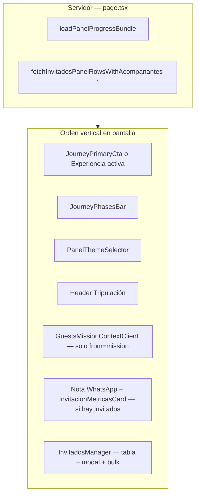
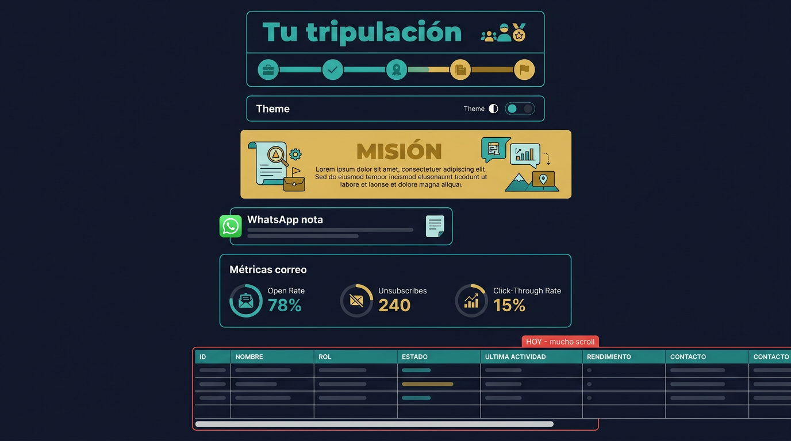
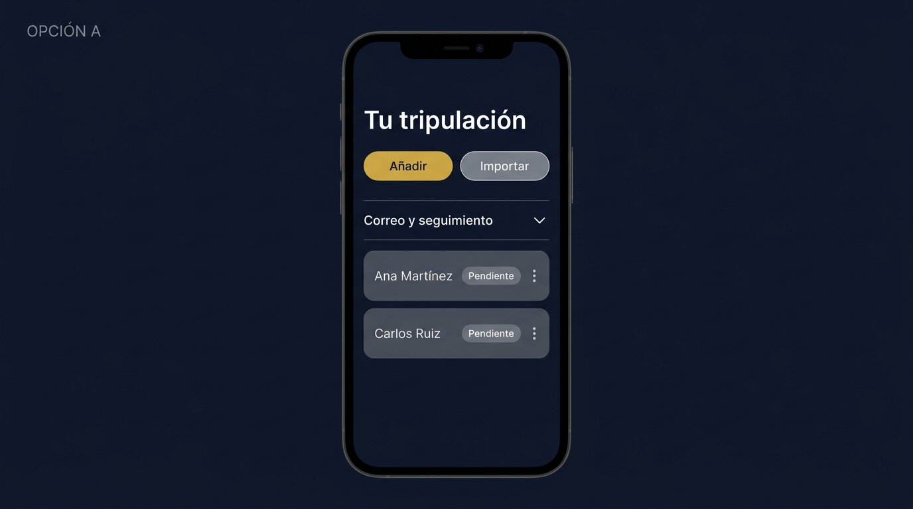
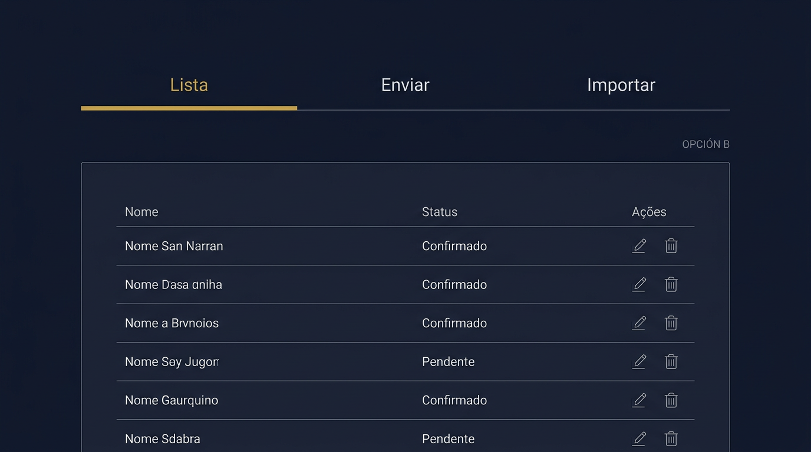

# Propuesta UX — `/panel/invitados` (Tripulación)

Documento de **revisión + alternativas** (sin implementación obligatoria hasta que elijas). Objetivo: **carga** (datos + cognitiva), **homologación** al look & feel del panel Jurnex, y **usabilidad** real (sobre todo móvil).

---

## 1. Arquitectura actual (resumen)



### 1.1 Carga de datos

| Tema | Detalle |
|------|---------|
| **Doble lectura** | `loadPanelProgressBundle` ya trae `invitados` (sin embed de acompañantes en el bundle). La página vuelve a pedir **`fetchInvitadosPanelRowsWithAcompanantes` con `*`** para la tabla. Es coherente para tener acompañantes, pero **hay trabajo duplicado** en cada visita. |
| **Hidratación** | Toda la lista llega al cliente en `InvitadosManager`; listas largas = más estado y re-renders. |
| **Sin paginación** | 100+ invitados = tabla larga y acciones repetidas en DOM. |

### 1.2 Carga cognitiva / usabilidad

| Problema | Impacto |
|-----------|---------|
| **Muchos bloques antes de la tabla** (journey, tema, header, misión, WhatsApp, métricas) | En móvil hay **scroll largo** hasta “Añadir invitado” y la tabla. |
| **Tabla `min-w-[800px]`** | **Scroll horizontal** casi seguro en iPhone; no es patrón mobile-first fuerte. |
| **Columna Acciones** | Hasta **6 controles** por fila (mensaje flash + copiar + WhatsApp + enviar correo + editar + eliminar): difícil de pulsar con el pulgar y fácil equivocarse. |
| **CTA duplicado conceptual** | “Enviar invitación” por fila + envío masivo en `InvitacionMetricasCard`: correcto a nivel producto, pero la UI no **explica la jerarquía** (“primero masivo, después retoques”). |

### 1.3 Look & feel vs lineamientos

| Elemento | Observación |
|----------|-------------|
| **Acentos** | Predomina **teal** (alineado al journey). En la misma tabla, “Enviar invitación” usa **navy `#001d66`** — mezcla con tokens “oro + navy” del panel premium (`product-context`, `panel-themes`). Conviene **unificar**: primario oro/teal según decisión de diseño, secundario consistente. |
| **Tarjetas** | `InvitacionMetricasCard` y bloque WhatsApp ya usan `rounded-2xl` / bordes sutiles — **bien**; la tabla es más “cruda” (mismo estilo que muchos admin tables). |
| **Patrón de página** | Igual que Evento/Programa: `max-w-4xl` + bloque journey arriba. **Homogéneo**; falta sobre todo **orden de secciones** y **densidad** en móvil. |

---

## 2. Criterios de éxito (para cuando implementes)

1. En **iPhone 12 / Pixel 5**: poder **añadir un invitado** y **enviar correo masivo** sin sentirse perdido en scroll infinito.  
2. **Una** jerarquía clara: lista ↔ envío ↔ importación.  
3. Tokens de color **documentados** (teal journey vs oro premium) sin mezclar navy suelto en botones sueltos.  
4. Reducir o paginar filas cuando `N > umbral` (p. ej. 25).

---

## 3. Alternativas de solución (elegí una o combiná)

### Opción A — “Tripulación compacta” (recomendada como MVP)

**Idea:** Mantener una sola página, pero:

1. **Plegar** bloque WhatsApp + métricas en un **acordeón** “Enviar por correo y seguimiento” (abierto por defecto en desktop; cerrado en mobile con resumen “3 métricas”).  
2. **Reordenar:** toolbar “Añadir / Importar” **justo debajo del título** (o sticky bajo el journey), **antes** de métricas.  
3. **Móvil:** sustituir tabla por **tarjetas** (una por invitado: nombre, RSVP chip, acciones en menú “⋯”). Desktop mantiene tabla.

**Pros:** Mejor sin reescribir rutas; gran mejora móvil.  
**Contras:** Dos layouts (card vs table) a mantener.

**Boceto ASCII (móvil):**

```
┌─────────────────────────┐
│ Journey (compacto)      │
├─────────────────────────┤
│ Tu tripulación          │
│ [+ Añadir] [Importar]   │
├─────────────────────────┤
│ ▸ Correo y seguimiento  │  ← acordeón
├─────────────────────────┤
│ ┌─────────────────────┐ │
│ │ Juan Pérez          │ │
│ │ Pendiente    [⋯]    │ │
│ └─────────────────────┘ │
│ ┌─────────────────────┐ │
│ │ María …             │ │
│ └─────────────────────┘ │
└─────────────────────────┘
```

---

### Opción B — Pestañas internas

**Idea:** Tres pestañas dentro de la misma URL (estado cliente o `?tab=`):

| Pestaña | Contenido |
|---------|-----------|
| **Lista** | Solo tabla/cards + añadir/editar. |
| **Enviar** | WhatsApp (nota) + `InvitacionMetricasCard` + link vista previa. |
| **Importar** | Atajo a modal de bulk o embed de `BulkImportInvitados` inline. |

**Pros:** Separa “gestionar personas” de “campaña de correo”; menos scroll.  
**Contras:** Un clic más para quien alterna entre lista y envío masivo.

**Boceto:**

```
[ Lista ] [ Enviar ] [ Importar ]
─────────────────────────────────
  (contenido de la pestaña activa)
```

---

### Opción C — Layout dos columnas (desktop) / apilado (móvil)

**Idea:** En `md+`: columna izquierda fija (~280px) con resumen (totales, RSVP, botones masivos, enlace `#envio-invitaciones`). Derecha: tabla con scroll propio.

**Pros:** Siempre visibles métricas y envío en pantalla ancha.  
**Contras:** Más CSS y pruebas responsive; móvil sigue necesitando Opción A o B.

---

## 4. Comparación rápida

| Criterio | A — Compacta + cards móvil | B — Pestañas | C — 2 columnas |
|----------|----------------------------|--------------|----------------|
| Esfuerzo | Medio | Medio | Alto |
| Mejora móvil | Muy alta | Alta | Media (sin A) |
| Descubre envío masivo | Acordeón / orden | Pestaña “Enviar” | Columna izq. |

---

## 5. Mockups visuales (PNG)

### Estado actual (referencia)



### Opción A — Compacta + cards en móvil



### Opción B — Pestañas Lista / Enviar / Importar



Archivos en `docs/`: `panel-invitados-mockup-hoy.png`, `panel-invitados-mockup-opcion-a.png`, `panel-invitados-mockup-opcion-b.png`.

---

## 6. Detalle técnico sugerido (post-validación)

- **Datos:** evaluar una sola query con acompañantes embebidos para bundle + página, o `select` explícito más liviano que `*`.  
- **Paginación:** `limit/offset` o “Cargar más” en cliente con RPC.  
- **Acciones por fila:** menú **⋯** con “Copiar enlace”, “WhatsApp”, “Enviar correo”, “Editar”, “Eliminar”.

---

## 7. Nota de copy (reglas Jurnex)

El banner de misión en `GuestsMissionContextClient` se alineó a **tuteo neutro** (sin “Agregá / Completá / compartí”).

---

*Siguiente paso:* indicá **A**, **B**, **C** o **A+B** (pestañas solo en móvil, etc.) y recién ahí se implementa en código.
